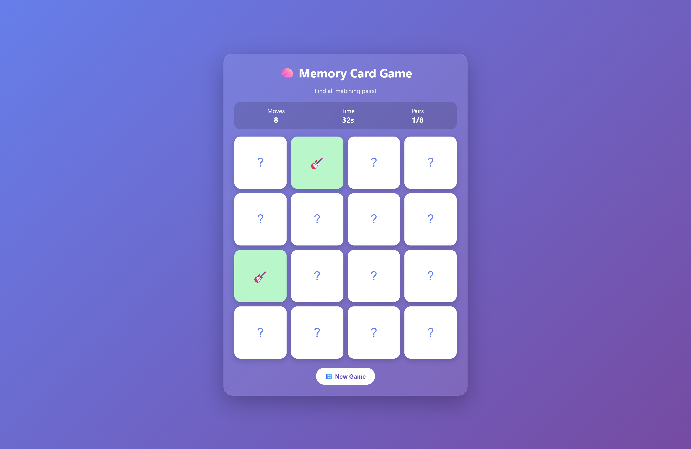

# 🧠 Memory Card Game

<div align="center">


A fun and interactive **Memory Card Game** built using **React.js** and **Vite**. Test your memory by flipping cards and finding all the matching pairs!

</div>

---

## 📸 Screenshot



---

## ✨ Features

- 🧠 Interactive memory card matching gameplay
- 🎴 Multiple pairs of cards
- 🔀 Random card shuffling on every new game
- ⏱️ Game timer
- 🔢 Move counter
- ✅ Match detection
- 🎉 Winning message after completing the game
- 🔄 Restart and play again functionality
- 📱 Responsive design
- ⚡ Fast development with Vite

---

## 🛠️ Technologies Used

- **React.js**
- **Vite**
- **JavaScript (ES6+)**
- **HTML5**
- **CSS3**

---

## 📂 Project Structure

```text
Memory-Card-Game/
│
├── public/
│
├── src/
│   ├── components/
│   ├── App.jsx
│   ├── App.css
│   ├── main.jsx
│   └── index.css
│
├── .gitignore
├── index.html
├── package.json
├── vite.config.js
└── README.md
```

---

## 🚀 Getting Started

Follow these steps to run the project locally.

### 1️⃣ Clone the Repository

```bash
git clone https://github.com/ajinkya029/Memory-Card-Game.git
```

### 2️⃣ Navigate to the Project Directory

```bash
cd memory-card-game
```

### 3️⃣ Install Dependencies

```bash
npm install
```

### 4️⃣ Start the Development Server

```bash
npm run dev
```

The application will start running on:

```text
http://localhost:5173
```

---

## 🎯 How to Play

1. Click on a card to flip it.
2. Click on another card to find its matching pair.
3. If the cards match, they remain visible.
4. If they don't match, they flip back after a short delay.
5. Continue matching all pairs.
6. Complete all matches to win the game! 🎉

---

## 📜 Available Scripts

### Start Development Server

```bash
npm run dev
```

### Build for Production

```bash
npm run build
```

### Preview Production Build

```bash
npm run preview
```

---

## 🧩 Future Improvements

- 🏆 High score system
- 🔊 Sound effects
- 🎨 Multiple themes
- 🎯 Difficulty levels
- 👥 Multiplayer mode
- 💾 Save game progress using Local Storage
- 🥇 Leaderboard
- 🌙 Dark mode

---

## 🤝 Contributing

Contributions are welcome!

1. Fork the repository.
2. Create a new branch.

```bash
git checkout -b feature/YourFeature
```

3. Make your changes.
4. Commit your changes.

```bash
git commit -m "Add YourFeature"
```

5. Push to your branch.

```bash
git push origin feature/YourFeature
```

6. Open a Pull Request.

---

## 📄 License

This project is licensed under the **MIT License**.

---

## 👨‍💻 Author

**Ajinkya Dhatrak**

GitHub: https://github.com/ajinkya029

---

<div align="center">

⭐ If you like this project, don't forget to give it a star!

Made with ❤️ using React.js

</div>
